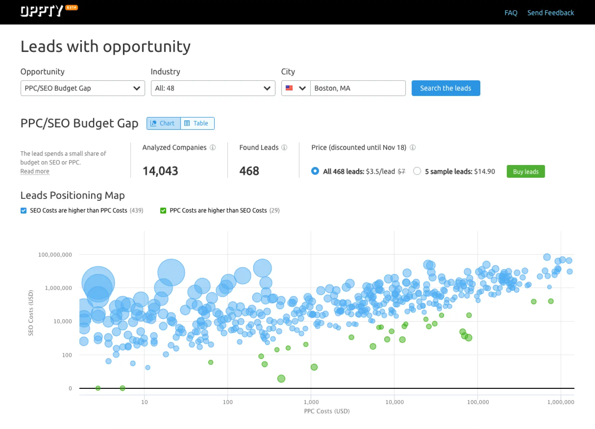

## About the company

An international company, developing a high-load SaaS for internet marketers.

## My teams and projects

Was part of a department of 17 UX designers and 10 UI designers, working with three development teams.

- Site Audit is a service for checking the technical health of websites. One of the largest and most popular services in Semrush.
- Oppty - a tool for finding potential clients.
- BeRush - an affiliate network.
- Agency Partners (concept) - directory of marketing agencies.
	
	
	

---

## Case study from Oppty

I'll show you how I found solutions to problems with a small example from a marketing tool called Oppty. It finds potential clients in a certain location and according to certain parameters.

[Финальный интерактивный прототип](https://rpghqp.axshare.com/#id=nl1gal&p=overview_%D1%81_%D1%84%D0%B8%D0%BB%D1%8C%D1%82%D1%80%D0%B0%D0%BC%D0%B8&c=1)

---

## Этапы нахождения решения

1. [Погружение в проблему, исследования и анализ](https://www.notion.so/Semrush-59d86e894d4340f8a2908f4a2f884a31).
2. [Поиск идей](https://www.notion.so/Semrush-59d86e894d4340f8a2908f4a2f884a31).
3. [Прототипирование и проверка решений](https://www.notion.so/Semrush-59d86e894d4340f8a2908f4a2f884a31).
4. [Передача на следующие этапы разработки](https://www.notion.so/Semrush-59d86e894d4340f8a2908f4a2f884a31).
5. [Сопровождение разработки](https://www.notion.so/Semrush-59d86e894d4340f8a2908f4a2f884a31).
6. [Проверка успешности решения](https://www.notion.so/Semrush-59d86e894d4340f8a2908f4a2f884a31).

---

## 1. Погружение в проблему, исследования и анализ

Мало продаж, небольшой средний чек.
Гипотеза: во многих случаях набор данных получается слишком большим, пользователи не готовы купить такой набор. На скриншоте — список из 468 клиентов из Бостона за $1,638.

1. Отобрал и проанализировал пользовательский фидбек про эту проблему.
2. Продакт оунер провела серию интервью с европейскими агентствами. Подтвердила гипотезу, узнала как они находят себе клиентов, и как мы можем им помочь. Выяснили также, что у каждого агентства немного разный стиль поиска клиентов.
3. Составил окончательный список требований.
4. Составил и согласовал критерии успешности. Это те метрики, которые отслеживаем после разработки.

---

## 2. Поиск идей

1. Составил список возможных паттернов для решения подобных задач. Источники: другие сервисы Semrush, каталоги UX-паттернов и известные сайты.
2. Сделал несколько набросков с возможными вариантами взаимодействия.
3. Собрал встречу с командой разработки, чтобы обсудить детали реализации. Какие-то варианты были дорогие, от них отказались.

---

## 3. Прототипирование и проверка решений

### Первая версия, дешёвая в разработке

Версия без значительных изменений в существующем интерфейсе.

Провёл несколько юзабилити-тестов на коллегах-маркетологах. У большинства респондентов были значительные затруднения при прохождении заданий.

Вывод: изменения усложнили сервис и повысили порог вхождения, это может снизить конверсию.

### Вторая версия, переосмысление компоновки

- Поменял компоновку на более простую и компактную.
- Поговорил с командой про целесообразность и стоимость разработки
- Получил фидбек от UX- и UI-команд, внёс изменения.
- Провёл тестирование на других на коллегах-маркетологах, критичных проблем не выявил.

Использовали упрощённую схему редизайна, без отдельной бета-версии. В сервисе мало постоянных пользователей и такие изменения не приведут к негативным последствиям.

---

## 4. Передача на следующие этапы разработки

- Проработал список всех возможных состояний элементов и описал, как они должны работать.
- На груминге с командой разработки презентовал окончательную версию решения.
- Поняли, что все задачи по разработке не вмещаются в спринт, поэтому договорились разбить внедрение функции на этапы: сначала сделаем самое необходимое и будем наблюдать, как пользователи это используют.
- Добавил ивенты для Google Analytics. Это те клики на интерактивные элементы, которые потом помогут понять, как пользователи взаимодействуют с нашим сервисом и что можно улучшить.
- В таск-трекере подробно описал задачи для UX-писателя, UI-дизайнера и разработчиков. Отдельно ввёл в курс дела и ответил на все вопросы.

---

## 5. Сопровождение разработки

- Консультировал и пояснял непонятные моменты в гайдах.
- После разработки проверил, всё ли реализовано так, как задумывалось, и соответствует ли это дизайн-системе, составил список правок.

---

## 6. Проверка успешности решения

- После разработки следил за тем, как реальные пользователи используют обновлённый интерфейс. Чтобы отследить использование ключевых интерактивных элементов, использовал Inspectlet и SQL c BigQuery.
- Потом мы увеличили трафик в инструмент. Через какое-то время проверили метрики монетизации из критериев успешности и подтвердили, что новый дизайн работает хорошо.

