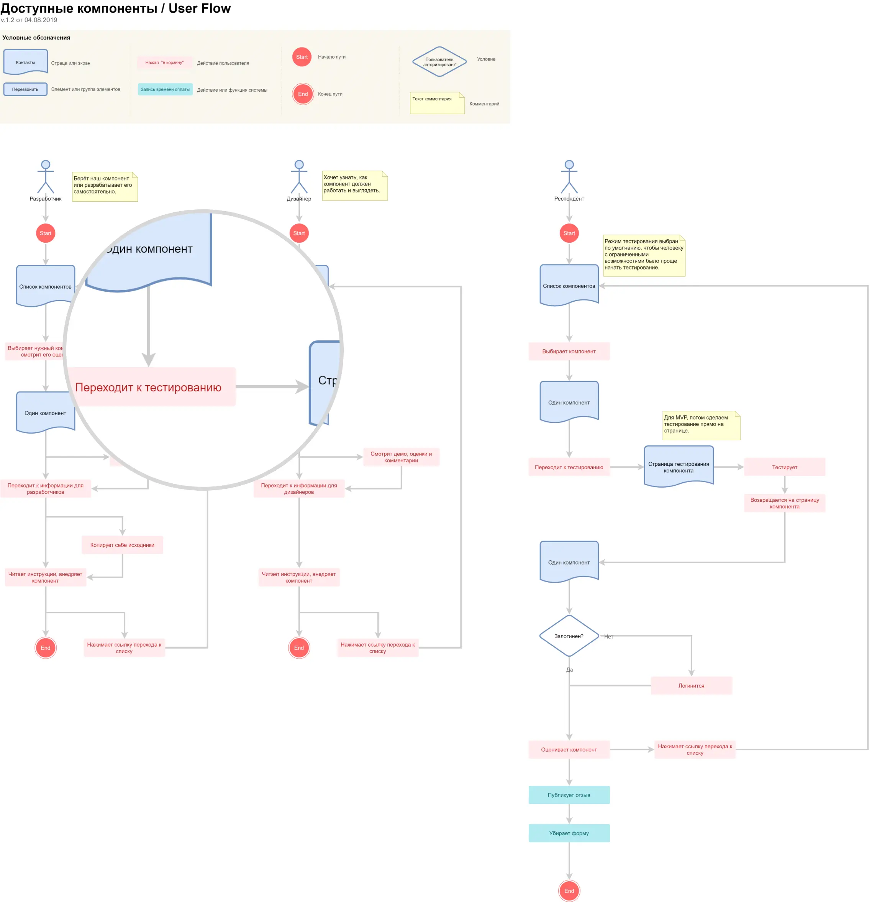
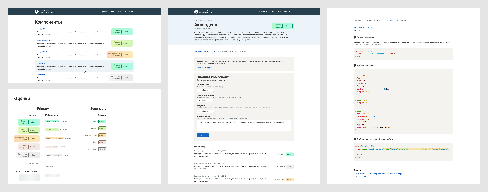
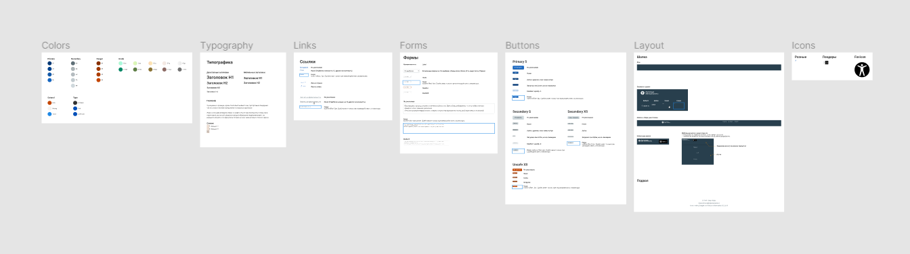

# Описание

Каталог протестированных UI-компонентов для разработчиков и дизайнеров. Качество компонентов могут протестировать не только люди с ограниченными возможностями, но специалисты, которые заинтересованы в удобных интерфейсах.

Тут кратко описываю процесс проектирования MVP. Для первой версии выбраны решения, которые дешёвы в разработке.

[Прототип Axure RP](https://k90cvf.axshare.com)

[Figma](https://www.figma.com/file/DiYCUz0N01asW8Y05rbozhJL/Accessible-Components?node-id=0%3A1)

## Решаемые проблемы

1. Фронтендеры и дизайнеры хотят разработать интерфейс для людей с ограниченными возможностями. Такие интерфейсы должны быть удобными и соответствовать стандартам. Примеры из интернета сложны, а готовые библиотеки компонентов часто недоступны.
2. Люди с ограниченными возможностями испытывают проблемы на сайтах и сервисах. Некоторыми ресурсами и вовсе не получается воспользоваться.

## 1. Погружение и разработка требований

Составил job stories, технические ограничения со списком внешних интеграций, use case diagram и изучил рефы.

## 2. Моделирование процессов

За основу взял диаграмму use cases и показал как 3 группы пользователей будут решать свои задачи, взаимодействуя с интерфейсом.

## 3. Прототипирование

[Интерактивный прототип Axure RP](https://k90cvf.axshare.com)

На первой вкладке пользователи скринридеров будут тестировать компоненты.

А на следующей пошагово объясняем, как сверстать компонент, как он должен работать и какие ARIA-атрибуты необходимы. Отсюда же разработчик может забрать React-компонент, если не хочет разрабатывать его самостоятельно.

# 4. Дизайн-макет

[Figma](https://www.figma.com/file/DiYCUz0N01asW8Y05rbozhJL/Accessible-Components?node-id=0%3A1)

