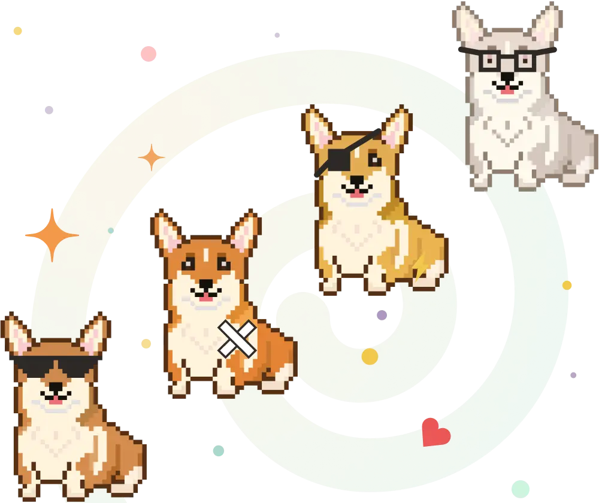

Один из организаторов первого в России митапа о доступности.

Митап ориентирован на фронтенд-разработчиков, UI- и UX-дизайнеров, QA-инженеров, копирайтеров, UX-писателей, менеджеров и руководителей проектов.

Доступность, accessibility или коротко a11y — это набор методов и технологий создания интерфейсов для людей с особыми потребностями. Но следование этим правилам помогает сделать интерфейсы удобнее и доступнее для всех.

[Плейлист митапа на YouTube](https://www.youtube.com/watch?v=LIi-fRukS1Y&list=PLTdS5E3zupkGg0FoMoWB5FD2tlBrSWUQB&index=7)

[Описание на GitHub](https://github.com/pitercss/a11y_docs)

