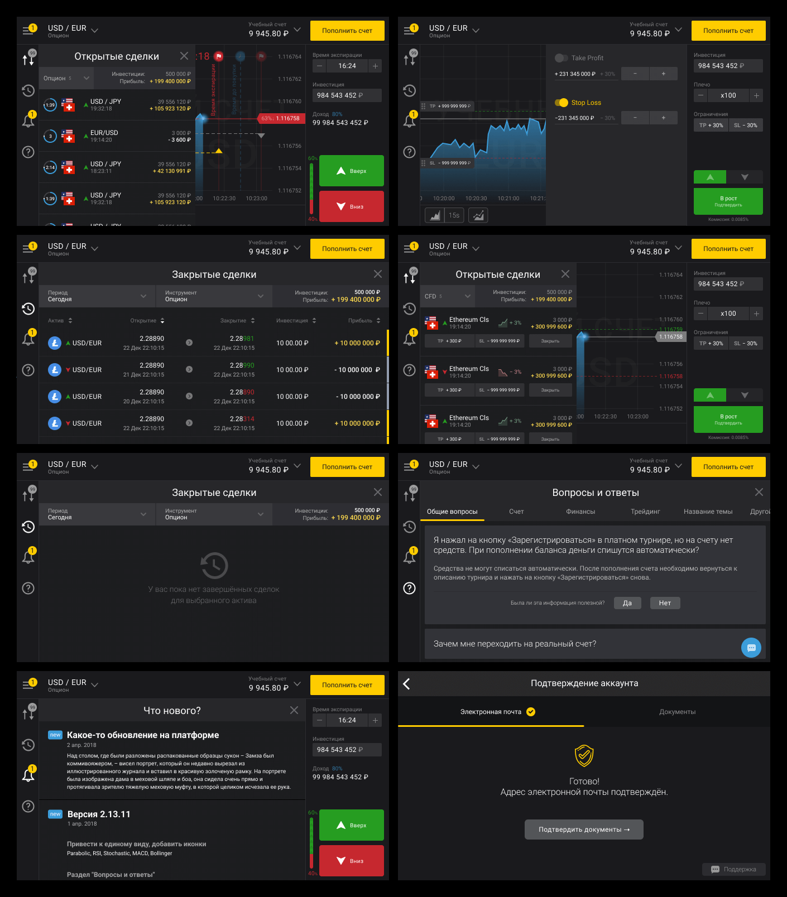

	
As a UX designer I led design of trading apps for Android and iOS, focusing on user experience and business challenges. To achieve this, I analyzed user feedback, utilized Sketch and Axure RP, and developed information architecture, user flows, UML Activity Diagrams, and CJMs. I optimized the design process with a UI kit, conducted UX tests and competitive analysis, and collaborated with my Scrum team and localization specialist.

.png)

